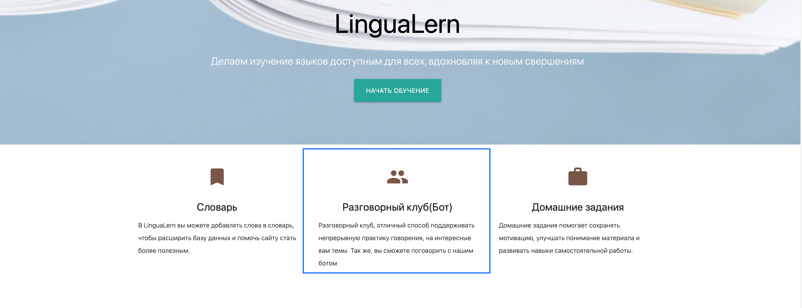
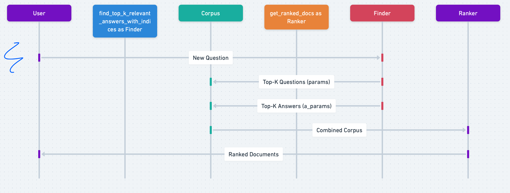

# LinguaLearn
Учебный проект: Сайт об изучении иностранных языков. 

В данный проект добавлена новая функциональность - retrival based chat bot.
Bot реализует предоставление ответов, на английском языке, исходя из запроса пользователя,
подбирая наиболее релевантные цитаты Доктора Хауса из сезонов сериала.

Для поддержания диалога с пользователем реализована система асинхронного взимодействия с предварительно обученными моделями.
За основу в итоговое решение включены предварительно обученные модели семейства Bert. 

Для реализации Bi Encoder (Формирует предвариельную выборку наиболее релевантных ответов) использовалась модель Sbert.
Для подготовки ответа используется подход одновременного семантического поиска по предварительно сохраненной базе эмбедингов как 
вопросов, так и ответов. В результате формируется топ 5 наиболее релевантных ответов для каждой группы. 

Сформированная группа из 10 наиболее релевантных ответов подается в СrossEncoder, так же реализованный на базе модели Bert и 
дообучен на имеющемся дата сете. В результате проведения re-ranking модель определяет наиболее релевантный и возвращает ответ  
пользователю. 
Бот хранит и передает небольшой контекст - 4 последних вопроса пользователя. Контекст хранится в течении одной сессии 
WebSoket соединения, после чего обнуляется. Такой подход реализован в связи с отсутствием полноценной пользовательской 
сессии в приложении.

Страница с ботом находится в разделе "Разговорный клуб"



Общая схема работы бота



Инструкции для локального запуска сервиса в WS

Установка зависимостей: 
Используется виртуальное окружение: poetry install
Активируем виртуальное окружение: poetry shell

### Далее стартуем само приложение: 

1. Consumer -- daphne -p 8001 LinguaLearn.asgi:application
2. Приложение  python manage.py runserver --важно. в репозиторий не загружены модели. Без загрузки при старте сервис будет падать. Инструкция ниже
3. В приложении жестко "вшито" обращение к модели с использованием api_url = f'http://127.0.0.1:8000/api/response-lookup/'
Если при запуске runserver приложение запускается на другом хосте. требуется заменить api_url в consumers.


ВАЖНО! Для запуска проекта не стоит использовать  Docker, так как не было завершена настройка взаимодействия контейнеров.

##### Тяжелые модели выведены из репозитория с помощью git lfs 

При необходимости загрузить модели возможно из репозитория:
https://drive.google.com/drive/folders/1XQWhmpbdsICSctC292KnkfBKmHLqb8kk?usp=share_link
Скачивать папку неободимо полностью, после чего разместить файлы в соответсвующей папке блока moduls. 
При замене модели, необходимо ссылку в Config


## Первоначальные требования к проекту 

### Описание
В этом модуле вам предстоит реализовать сервис, который будет состоять из телеграм-бота или веб-сайта, объединённых одной темой — изучение иностранных языков.

### Варианты использования телеграм-бота:
запись новых слов (последовательно вводить слово и перевод)
запись информации об уроках (вводить дату урока, пройденные темы, оценку сложности)
запись информации об учебниках/материалах (вводить название материала, ссылку, если есть, и оценку)

### Варианты использования веб-сайта:
списки слов и уроков, которые были записаны раньше
Anki-подобные карточки для запоминания слов (слово — иллюстрация (при наличии) — перевод)
форма для загрузки карточек
страница, отображающая карточки в виде таблицы


Для запуска тестов и статических анализаторов используйте следующие команды (убедитесь, 
что вы находитесь в корневой папке проекта):
```commandline    № не реализовывалось 
poetry run pytest --cov
poetry run mypy --strict bookkeeper
poetry run pylint bookkeeper
poetry run flake8 bookkeeper

### Зависимости проекта:
1. Обновляем зависимости pip freeze > requirements.txt
2. Параллельно ведем файл pyproject

# Напоминание где остановился. 

Создана база проекта, установлены библиотеки, сформирована основная структура файлов. 
Для тестового запуска использовалась рандобно сгенерированная страница. страница 
Создан файл базы данных, при этом не описана логика работы с БД.
______________
V1
1. Создана страница авторизации с учетом паттерна pase page. Настроены ссылки на страницу авторизации
2. Создана, но не реализована функционально страница авторизации пользователя, исходя из отсутсвия реализации созданы модели 
Все ограничано тем, что нет пользователей и поэтому в БД не сохраняются данные о пользвателе который добавил запись в словарь 
3. Создана форма авторизации на сайте. 
4. сделаны задатки для авторизации на сайте 
5. Сформирован словарь, с методами CRUD
6. Используется внешние библиотеки и дизайн системы. 
7. Поскольку проект предлагает возможное развитие не осознано не удалены все теги TODO 

____________________________________________________
v2
1. В ранее созданный проект добавлена реализации retrival based chat bot.
2.Бот эмулирует ответы главного персонажа сериала House M.D.
3. Локально загжены модели и матрицы эмбедингов. 
4. Требуется перевод на хранание моделей и матриц в базе данных, в том числе 
использование pikl.
6. Через Config в настройках бота можно изменить используемую модель в BiEncoder 
и CrossEncoder.  


